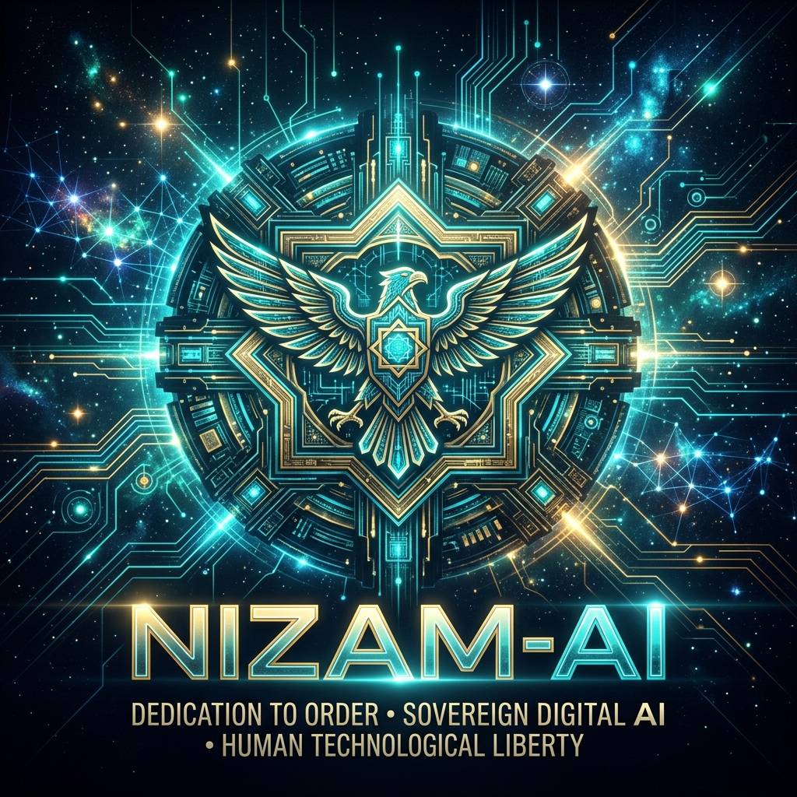
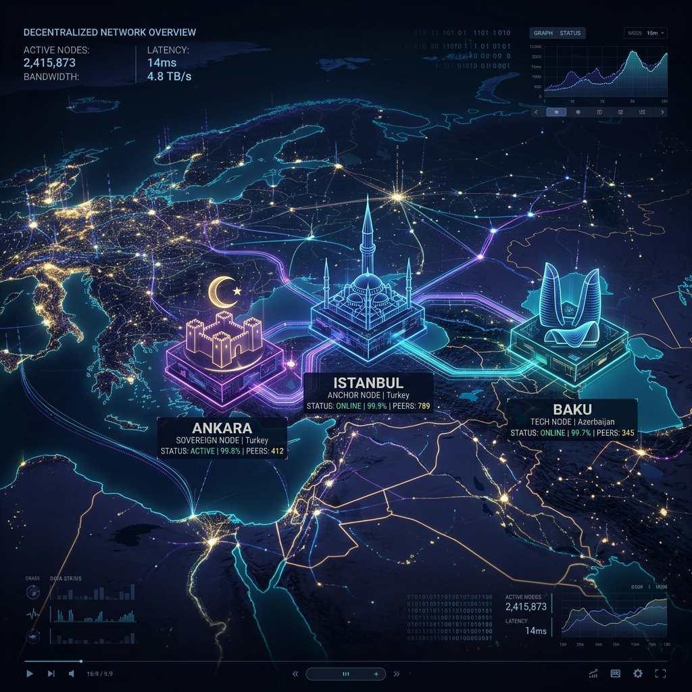
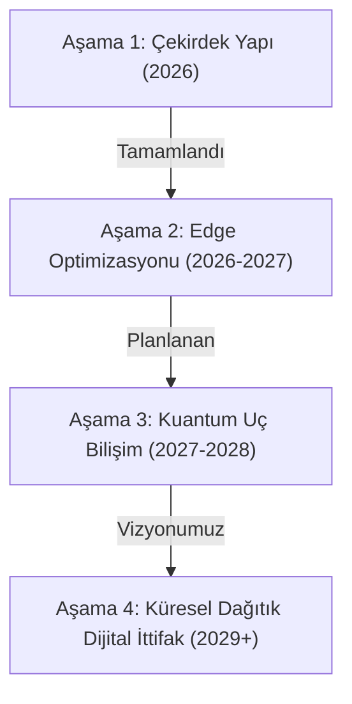

# Nizam-AI

<p align="center">
  
  <br>
  <em>"Kendi dijital geleceğine ve adaletli bir nizam anlayışına adanmış özgür zihinlerin sarsılmaz kalesi."</em>
</p>

**Küresel Dijital Egemenlik, Dağıtık Yapay Zeka ve İnsani Teknoloji Mimarisi**

> *"Makinelerin insan gibi düşünebilmesi için, onların sadece verilen formülleri uygulaması yetmez. Tıpkı insan gibi, kendi kendilerine amaç edinebilmeleri, kavramsal genellemeler yapabilmeleri ve felsefi bir şuura yaklaşabilmeleri gerekir."*  
> — **Ord. Prof. Dr. Cahit Arf (1959 - "Makine Düşünebilir mi?" Konferansı)**

> *"Hayatın ve varoluşun sadece sayılarla ve formüllerle ölçülebileceğini sananlar, insanın ruhunu ve şuurunu makinelere kurban edenlerdir. Bizler makinelerin efendisi olmalıyız, kölesi değil."*  
> — **Aliya İzzetbegoviç**

> *"Kendi dilini, kendi kavramlarını kaybeden bir millet, efendisinin dilinde konuşan köleler yığını haline gelir. Dijital dünyada kendi kelimelerimizle konuşmak bağımsızlığımızın ilk şartıdır."*  
> — **Cemil Meriç**

> *"Bir sistemin amacı, yaptığı şeydir (The purpose of a system is what it does). Eğer küresel silikon tekellerinin kurduğu yapay zeka sistemleri zihinleri tek tipleştiriyor ve gözetimi kurumsallaştırıyorsa, bu sistemlerin yegane amacı tahakkümdür. Nizam-AI bu amaca karşı inşa edilmiş bir özgürlük yapısıdır."*  
> — **Stafford Beer'ın Siberknetik Teorisi Işığında**

---

## 📖 Giriş: Küresel Dijital Özgürleşme Bildirgesi

**Nizam-AI**, verilerimizi ve dijital egemenliğimizi küresel teknoloji oligopollerinin tekelleşmiş tahakkümünden kurtarmak; başkalarının dikte ettiği algoritmik kalıpları, dilsel sömürgeleri ve kültürel önyargıları takip etmek yerine kendi kurallarımızı koyarak küresel çapta bir **"dijital paradigma kırılması"** yaratmak amacıyla **Arat** teknoloji girişimi bünyesinde hayata geçirilmiş açık kaynaklı, bağımsız bir ekosistem projesidir.

Günümüzde, yegane gayesi kar maksimizasyonu ve gözetim kapitalizmi olan silikon vadisi tekelleri, neredeyse tüm küresel enerji kaynaklarını tüketen devasa veri merkezleriyle adeta modern çağın firavunlarının kaba güçle inşa ettiği piramitleri andıran yapılar kurmaktadır. İnsanlığı dijital ayak izlerine kadar takip eden, zihinleri ve özgür iradeleri tek bir algoritmik merkezden esir alan bu **"gönüllü dijital kölelik fermanına"** karşı Nizam-AI; şeffaf, tam denetlenebilir, gömülü sistemlerde dahi yüksek performansla çalışabilen, mahremiyeti sınırların içinde koruyan insan odaklı ve merkeziyetsiz bir mimari sunar.

---

## 🧠 Felsefi Duruşumuz ve Küresel Vizyonumuz

İnsanı algoritmaların altında ezilmeye mahkum gören transhümanist iddiaları veya teknolojiyi insanın yerine geçecek yeni bir tanrı gibi kurgulayan tehlikeli yanılgıları kökten reddediyoruz. En dahi beşeri zihinlerin bile evrende tek bir atomu yoktan var edemediği gerçeğinden yola çıkarak, kendi ürettiğimiz istatistiksel modeller üzerinden bir "yaratıcılık kibri" kuşanmaya kalkışmıyoruz.

Bizim için yapay zeka; kutsanacak bir nesne değil, *"hafızası olan ama hatırası olmayan, rakamların ruhsuz labirentine sıkışmış istatistiksel bir yankıdan"* ibarettir. Asıl kurucu güç makinenin işlem hızı değil; alemin mimarının insana üflediği ruh, sezgi ve insanın özgür şuurudur.

### 🌐 Küresel Vizyonumuz: Çok Kutuplu ve Sınırsız Dijital Vatan

Nizam-AI, sadece yerel bir teknoloji hamlesi değil, aynı zamanda küresel düzeyde dayatılan tek merkezli dijital sömürgeciliğe karşı **uluslararası bir alternatif yol göstericidir**.

* **Veri Egemenliği Sınır Çizgisi:** Fiziksel sınırların güvenliği (Mavi Vatan, Kara Vatan) ne kadar hayatiyse, veri sınırlarının korunması (Siber Vatan, Dijital Egemenlik) da o kadar vazgeçilmezdir. Bir ülkenin vatandaşlarının ürettiği veri, o ülkenin doğal kaynağıdır ve dışarı sızdırılamaz.
* **Kültürel Çeşitliliğin Korunması:** Bugün batı merkezli büyük dil modelleri, tüm dünyayı tek tipleştirilmiş ahlaki, siyasi ve kültürel normlara zorlamaktadır. Nizam-AI, farklı medeniyetlerin kendi dilsel ve kültürel değerleriyle eğitilmiş modelleri yerel olarak barındırmasını savunarak küresel kültürel çeşitliliği korur.
* **Mazlum Coğrafyalar İttifakı:** Teknoloji tekellerinin yüksek donanım maliyetleri ve veri ambargoları altında ezilen dost ve kardeş coğrafyalarla açık kaynaklı kod ortaklığı kurarak, teknolojik kalkınmada fırsat eşitliği sağlıyoruz.

---

## 📜 Geçmişimiz (Nasıl Başladık?)

> *"İnsanlığın insanlığına yakışır bir şekilde kullanılması (The human use of human beings) ancak makinelerin insan zihnini taklit etmek yerine onun hizmetinde sınırlandırılmasıyla mümkündür."*  
> — **Norbert Wiener, Siberknetiğin Kurucusu**

Nizam-AI projesi, yapay zeka alanındaki gidişatın insanlığı tehdit eden iki temel çıkmaza girdiğinin fark edilmesiyle doğmuştur:
1. **Kaynak Tüketim Çıkmazı:** Küresel LLM modellerinin tek bir kelime üretmek için harcadığı su ve elektrik miktarları gezegeni tüketmektedir. Oysa insan beyni, evrendeki soyutlamaları ve kararları sadece **20 watt** enerjiyle gerçekleştirebilmektedir.
2. **Kültürel Kolonizasyon Çıkmazı:** Küresel dil modellerinin ahlaki ve kültürel algısı, Batı dünyasının sosyal yapısına göre şekillenmektedir. Türkçe ve diğer diller, bu modellerde sadece birer çeviri objesi olarak kalmaktadır.

Bu iki problemi çözmek amacıyla, 2026 yılı başında Arat girişimi bünyesinde, sembolik mantık ve istatistiksel modelleri birleştiren **Melez Yapay Zeka (Hybrid AI)** felsefesiyle yola çıktık. C++ tabanlı optimize edilmiş bir çekirdek ile Python'ın esnekliğini birleştiren ilk prototiplerimizi bu doğrultuda ürettik.

---

## 🎯 Temel Teknolojik Çözümler ve Mimari

### 1. Melez İstatistiksel Yapay Zeka (Hybrid AI)

Büyük modellerdeki ilerleme vizyonumuz, teravatlarca enerji tüketen ruhsuz veri merkezlerine ve donanım tekellerinin güdümündeki istatistiksel yığınlara dayanmaz.
* **Sembolik Akıl Yürütme ve Karar Kuralları:** Salt kaba işlem gücü yerine insanın kavramsal düşünme mekanizmasını taklit eden mantıksal kuralları istatistiksel olasılıklarla birleştiriyoruz. C++ tabanlı mantık motorumuz, veriyi milisaniyeler düzeyinde değerlendirir.
* **Gereksiz Hesaplama Engelleme:** Sembolik filtreler sayesinde model, girdi verisinin anlamlıliğini en başta denetleyerek gereksiz nöral ağ katmanlarını çalıştırmaz ve enerji tüketimini en uç noktada minimize eder.

### 2. Uç Bilişim (Edge AI) ve Gömülü Sistem Optimizasyonu

* **Donanım Özgürlüğü:** Büyük modelleri hantal bulut sunucularından kurtarıp, düşük güç tüketen gömülü donanımlarda doğrudan çalıştırılabilir hale getiriyoruz.
* **Çift Katmanlı Yapı:** Arat'ın mühendislik vizyonuyla şekillenen **C++** tabanlı yüksek performanslı çekirdek mimarimiz sayesinde donanım kısıtlamalarını aşarken (8-bit ve 1-bit binary nicemleme ile), **Python** destekli orkestrasyon katmanımızla esnek ve hızlı bir kurumsal geliştirme ortamı sunuyoruz.
* **Sıfır Gecikme, Maksimum Gizlilik:** Sensör verisi yerelde işlenir, kararlar anlık olarak cihaz üzerinde verilir. Tedarik zincirlerine sızdırılan bombalarla cepteki cihazların birer silaha dönüşebildiği bu çağda, donanım seviyesinden yazılım katmanına kadar **tam denetlenebilir açık kaynak** modelini şart koşuyoruz.

### 3. Dağıtık Ağlar ve Veri Mahremiyeti (Distributed Learning)

<p align="center">
  
</p>

* **Federated Learning (FedAvg):** Verilerimizi tekellerin sunucularına teslim etmek yerine, verinin kendi kurumlarımızda ve sınırlarımız içinde kaldığı dağıtık öğrenme ağları kuruyoruz.
* **Merkeziyetsiz Ağırlık Birleştirme:** Algoritmalar mahremiyeti koruyarak uç düğümlerde (node) öğrenir. Sunucuya ham veri yerine sadece eğitilmiş model parametreleri (ağırlıklar) gönderilir ve bu ağırlıklar FedAvg protokolüyle birleştirilerek küresel modele aktarılır.

### 4. Kuantum Özellik Haritalama (Quantum Feature Map)

Nizam-AI, geleceğin hesaplama altyapılarına bugünden hazırdır:
* **Qiskit ile Kübit Kodlaması:** Girdileri kuantum durumlarına (superposition) taşıyan, Ry rotasyonları ve CNOT dolaşıklık (entanglement) kapıları kullanan bir kuantum özellik katmanı barındırır.
* **Milli Güvenlik ve Şifreleme:** Kuantum sonrası kriptografi (PQC) adımlarını simüle eden ve veri transferlerini kuantum gürültüsüne karşı koruyan koruyucu katmanlar sunar.
* **Matematiksel Simülasyon Fallback'i:** Kuantum donanımı veya simülatörü (Qiskit-Aer) bulunmayan cihazlarda, matematiksel unitary matris çarpımları kullanarak 1-to-1 uyumlulukta çalışmaya devam eder.

---

## 🌍 Uygulama Alanları ve Sektörel Pilotlar

### 🛡️ 1. Savunma ve Elektronik Harp (Nizam-Swarm)

* **Simülasyon Detayları:** `nizam/pilots/defense.py` bünyesindeki multi-agent İHA simülasyonumuz, merkezi bir kontrol istasyonuna ihtiyaç duymadan, yerel RF haberleşme menzillerinde otonom sürü (swarm) zekasıyla hareket eder.
* **Elektronik Harp Dayanıklılığı:** Sinyal kesici (jamming) unsurlar algılandığında, otonom düğümler yerel kararlar alarak kaçış ve üsse dönüş manevralarını tamamen lokal algoritmalarla çalıştırır.

### 🧬 2. Sağlık Teknolojileri (Nizam-Health)

* **Yerel Onkoloji Tanısı:** `nizam/pilots/health.py` içindeki modülümüz, float32 ağırlıklar yerine int8 formatına indirilmiş (quantized) modellerle uç mobil cihazlarda milisaniyeler altında hücresel teşhis yapar.
* **Biyolojik Güvenlik:** Kişisel sağlık verileri yabancı bulut sistemlerine gitmeden cihaz üzerinde işlenir.
* **Smart Drug Discovery:** 1-bit binary nicemleme tekniği kullanarak, moleküler eşleşmeleri 64 kat daha az işlemci döngüsüyle bularak yerel ilaç geliştirme aşamalarını hızlandırır.

### 📚 3. Eğitim ve Fırsat Eşitliği (Nizam-Edu)

* **Kişiselleştirilmiş Müfredat Adaptasyonu:** `nizam/pilots/education.py` modülü, öğrencilerin dikkat, yorgunluk ve geçmiş başarı metriklerini yerelde işleyerek en uygun ders temposunu belirler.
* **Milli Dil Modeli Entegrasyonu:** T3AI ile yapılan doğrudan entegrasyon sayesinde, Türkçe kültürel mirasa, bilimsel gerçeklere ve pedagojik ahlaka uygun eğitim içerikleri üretilir.

---

## 🤝 Ekosistem Paydaşları (Teknofest Kuşağı Projeleri)

Nizam-AI mimarisi, küresel dijital tahakkümü yıkmak üzere Teknofest kuşağının geliştirdiği şu projelerle tam entegre çalışacak şekilde tasarlanmıştır:

* **T3AI:** Türkiye Teknoloji Takımı Vakfı öncülüğünde geliştirilen, Türkiye'nin ilk yerli ve açık kaynaklı Büyük Dil Modeli (LLM) projesi. *"Dijital dünyada Türkçe konuşan bir ailen var"* mottosuyla ve ahlaklı yapay zeka felsefesiyle geliştirilmiştir.
* **En Sosyal:** İnsanları algoritmalarla kutuplaştırmayı reddeden, toxic-free (zehirsiz) ve güvenli, kurumsal bültenlerin paylaşıldığı sosyal ağ.
* **Küre:** T3 Vakfı ve Kültür ve Medeniyet Vakfı (KÜME) iş birliğiyle geliştirilen, müellifi belli, akademik denetimden geçmiş doğrulanabilir dijital bilgi kaynağı ansiklopedisi.

---

## 🔮 Gelecek Planları ve Yol Haritamız (Geleceği Tasarlamak)

Nizam-AI'yi önümüzdeki yıllarda küresel bir standart haline getirmek için vizyonumuz dört ana aşamada planlanmıştır:



### 📅 Aşama 1: Çekirdek ve Web Orkestrasyonu (2026) - **Tamamlandı**
* [x] C++ çekirdek mantık motorunun yazılması.
* [x] Python orkestrasyon katmanının ve ctypes bağlantılarının kurulması.
* [x] Kuantum Özellik Haritalama (Quantum Feature Map) modülünün Qiskit entegrasyonuyla yazılması.
* [x] Siber Güvenlik (PQC İmza Doğrulama, Byzantine Defansı) ve yerel SQLite veri tabanı motorunun (`nizam/storage.py`) yazılması.
* [x] Otonom İHA sürü simülasyonu, onkoloji tarayıcı ve eğitim asistanı pilotlarının kodlanması.
* [x] Flask tabanlı etkileşimli, neon-cam (glassmorphic) tasarımlı web dashboard'unun entegrasyonu.
* [x] Birim testleri (`tests_nizam/`) ve edge benchmark altyapısının kurulması.

### 📅 Aşama 2: Donanım Hızlandırma ve Çip Seviyesi Derleme (2026-2027) - **Aktif Geliştirme**
* [ ] C++ çekirdeğinin ARM Cortex-M ve RISC-V mimarilerine (gömülü mikrodenetleyiciler) doğrudan port edilmesi.
* [ ] NVIDIA Jetson, Raspberry Pi ve yerel İHA otopilot kartları (Pixhawk vb.) üzerinde gerçek zamanlı donanım testlerinin yapılması.
* [ ] T3AI modelinin yerel 4-bit nicemleme (quantization) modellerinin uç kartlara gömülmesi.

### 📅 Aşama 3: Kuantum Bilgi İşlem ve Kriptografik Düğümler (2027-2028)
* [ ] Qiskit ve Qiskit-Aer kütüphaneleriyle geliştirdiğimiz kuantum modüllerinin (mevcut bağımlılıklarımızda yer almaktadır) melez sisteme entegrasyonu.
* [ ] Dağıtık düğümler (node) arasındaki veri aktarımında **Kuantum Sonrası Kriptografi (PQC)** protokollerinin uygulanması.
* [ ] Kuantum benzerlik algoritmalarıyla smart drug discovery ilaç tarama işlemlerinin kuantum simülatörlerinde hızlandırılması.

### 📅 Aşama 4: Küresel Dağıtık Dijital İttifak (2029 ve Sonrası)
* [ ] Dünyadaki tüm bağımsız ve mazlum ülkelerin ulusal düğümlerini (Türkiye, Azerbaycan, Balkanlar, Orta Asya ve Afrika ülkeleri) içeren çok uluslu bir Federated Learning ağının kurulması.
* [ ] Küresel silikon tekellerine karşı ortaklaşa eğitilen, egemen ve sınırsız ortak dil modelinin hayata geçirilmesi.

---

## 🛠 Geliştirici ve Çalıştırma Kılavuzu

Nizam-AI ekosistemi, uç birimlerde melez yapay zeka performansı, sürü harp taktikleri, sağlık ön tanıları ve dağıtık öğrenmeyi (Federated Learning) içeren modüler bir yapıyla hayata geçirilmiştir.

### 📋 Gereksinimler

Proje bağımlılıklarını kurmak için:
```bash
pip install -r requirements.txt
```

### ⚡ Nizam-AI Yönetim Arayüzü (CLI)

Tüm işlemleri tek bir komut satırı arayüzünden (CLI) yönetebilirsiniz:

1. **Birim Testlerini Çalıştırma:**
   ```bash
   python nizam_cli.py --test
   ```

2. **Edge AI Optimizasyon ve Enerji Karşılaştırma Testleri (Benchmark):**
   ```bash
   python nizam_cli.py --benchmark
   ```

3. **Etkileşimli Web Arayüzünü (Dashboard) Başlatma:**
   ```bash
   python nizam_cli.py --dashboard
   ```
   Web arayüzü başlatıldıktan sonra tarayıcınızda **http://127.0.0.1:5000** adresine giderek sürü İHA simülasyonunu, dağıtık öğrenme yuvarlaklarını, Küre ansiklopedisini, T3AI entegrasyonlarını ve Siber Güvenlik denetim tablosunu test edebilirsiniz.

4. **Siber Güvenlik ve Yerel Veri Tabanı Raporu:**
   ```bash
   python nizam_cli.py --security
   ```

### 🔨 C++ Çekirdek Derleme Kılavuzu

Eğer sisteminizde C++ derleyicisi ve CMake yüklü ise, yüksek performanslı matematik çekirdeğini yerel ikili dosyaya (binary) derlemek için:

```bash
python build_core.py
```

Bu script, projenin en kökünde yer alan `CMakeLists.txt` dosyasını okuyarak otomatik derleme adımlarını gerçekleştirecek ve derlenen `.dll` veya `.so` dosyasını `nizam/` modülünün altına taşıyacaktır. Derleyici olmasa dahi Python orkestrasyonu otomatik fallback moduna geçerek sorunsuz çalışacaktır.

---

## 🤝 Katkıda Bulunma ve Kurumsal İttifak

Bu devrim sadece bir kod yazım süreci değil, **"insani bir teknolojik dayanışma ittifakı"** kurma çabasıdır. Arat çatısı altında profesyonel bir girişim ruhuyla, dost ve mazlum coğrafyalarla el ele vererek, tekellerin ördüğü ağları dağıtmak için gücümüzü birleştiriyoruz.

Eğer siz de makinenin değil, Eşref-i Mahlukat olan insanın hür iradesiyle dünyayı adaletle imar etmek istiyorsanız, kurumsal vizyonumuza destek olmaya, mimarimize katkı sunmaya (Pull Request) ve bu açık kaynak devrimine omuz vermeye davetlisiniz.

**Yolumuz açık, geleceğimiz hür olsun!**

---
